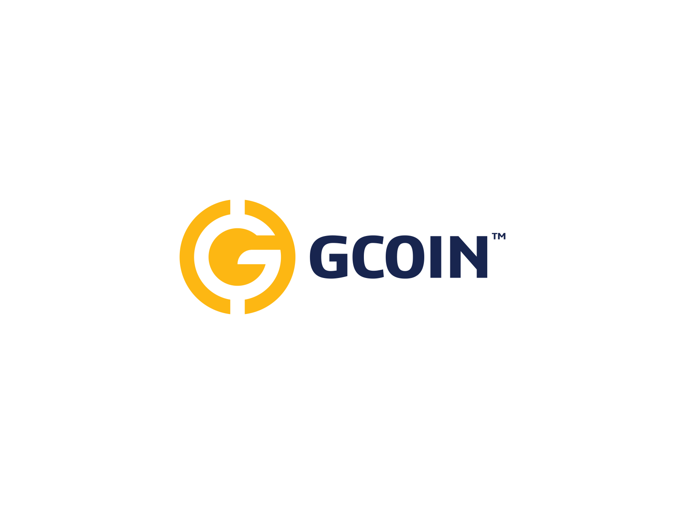

# Case_Study_GCoin
 FinTech Case Study: G-Coin

## Overview and Background
* The present study evaluates G-Coin as a key player in the FinTech space. Emergent Technology Holdings LP (EmTech), the parent company of G-Coin, was founded in 2017 by Brent De Jong.
G-Coin is a digital currency that is backed by gold, meaning investors can request that the physical gold is shipped to the address that they choose at any time. 
Traditionally, gold has been among the most illquid of investments, with high transaction costs and a spread between bid/ask. G-Coin gives investors the flexibility to send and receive value instantly, 
securely, and at no cost from the convenience of their mobile phone. G-Coin leverages blockchain technology to combine the best qualities of traditional gold - stability,
security, and value confidence - with the benefits of digital currency innovation. The company partnered with key gold industry leaders, including Yamana Gold, Valcambi sa,
and Asahi Refining, to create G-Coin tokens, structured so that each token is equivalent to one gram of gold.

## The Advantages of G-Coin
G-Coin was designed to offer solutions to several issues that exists across the gold industry as well as the cryptocurrency market. Some of the main problems in the gold industry lies in the 
supply chain of gold and ethics surrounding it. With the innovation of blockchain technology, companies like EmTech are able to improve transparency and ethics of precious 
metals sourcing. While there are other gold-backed cryptocurrencies, G-Coin the only one that claims theirs is backed by conflict-free gold. Using EmeTech's blockchain
supply chain solution, called Responsibile Gold, G-Coin is able to trace the origins of responsible, conflic-free gold through the entire chain from mining, to refining, and through 
to vaults. Similar to all other cryptocurrency transactions, the blockchain technology enables everyone from the miners to the refiners to logistics providers and insurance companies
to track the movement of the asset across an immutable digital ledger. Another benefit of G-Coin on the gold insutry is that it creates the opprotunity to get gold out to consumers and down to the retail level.

In addition to the positive impacts that G-Coin has on the gold industry, one of the key solutions that it provides in the financial industry is that it eliminates or reduces the high level of volitlity that is 
often associated with the cryptocurrency market. The issue with Bitcoin and most other digital currencies is that they have no backing. Thus, their value is dictated solely by how much someone is willing to 
pay for them. Conversely, G-Coin, at the very least, will always equal the current price of gold which makes them considerably less volitile. As history has shown, gold may fluctuate but it is still classed
as a very expensive and in-demand precious metal. The other benefit of G-Coin in the financial industry is the expansion of the traditional buying base for gold. For example, analyst reported B2B transactions 
alone are on track to exceed $210 trillion in the near future. 

Beyond the volitity of the cryptocurrency market, G-Coin also has the potential to have a greater effect on the global economy as it can protect companies against the vagaries of politics and economic downturns.
During time of extreme stress and inflationary pressures, the value of some currencies can plunge 30 percent to 50 percent. In 2018, the Argentinian peso and the Turkish lira were faced with these problems.
Mitch David, the Chief Commercial Officer at EmTech, said,"We see an opprotunity for G-Coin tokens in emerging markets as an alternative to local currencies, and as a superior store of value with greater liquidity."
G-Coin enables multinational companies to conduct cross-border transactions with greater speed and transparency. Davis explains, "With the G-Coin B2B wallet, corporations can move G-Coin tokens across borders in real time,
without transaction fees. Treasury deparments can hold G-Coin tokens, rather than volatile local fiat currencies, and cash out as needed on their own timelines, based on overall float management across liquidity pools."

## Landscape:
* What domain of the financial industry is the company in?
* What have been the major trends and innovations of this domain over the last 5-10 years?
* What are the other major companies in this domain?
## Results
* What has been the business impact of this company so far?
* What are some of the core metrics that companies in this domain use to measure success? How is your company performing, based on these metrics?
* How is your company performing relative to competitors in the same domain?
## Recommendations
* If you were to advise the company, what products or services would you suggest they offer? (This could be something that a competitor offers, or use your imagination!)
* Why do you think that offering this product or service would benefit the company?
* What technologies would this additional product or service utilize?
* Why are these technologies appropriate for your solution?